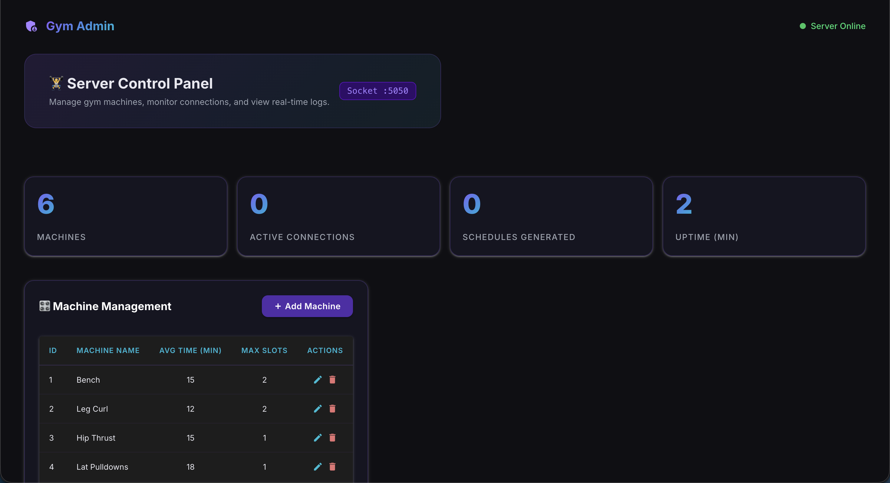
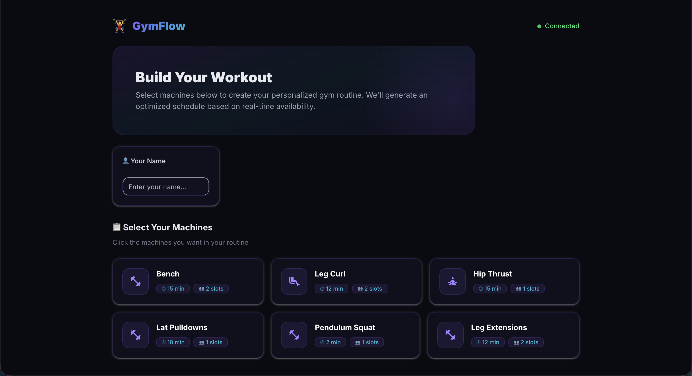
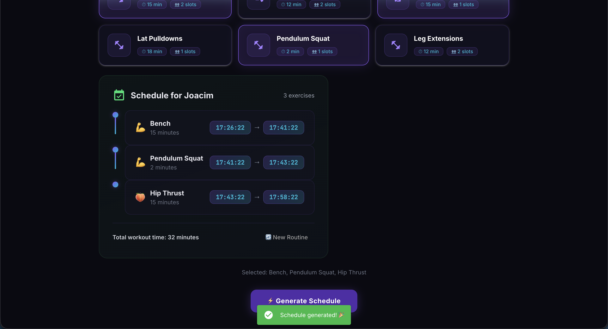
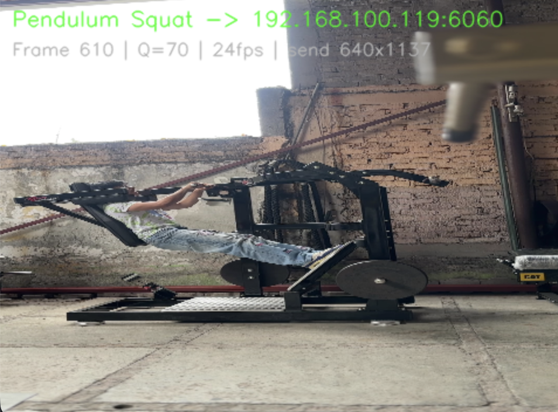
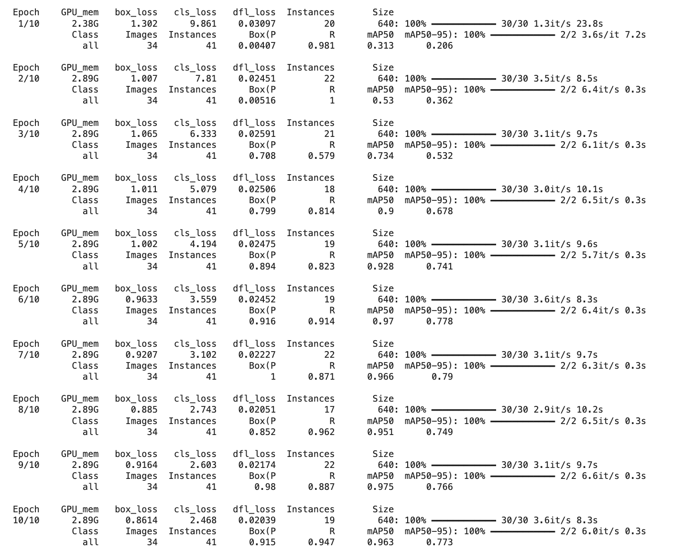

# GymFlow — Intelligent Gym Monitoring & Scheduling System

A **multi agent system** that uses real-time computer vision (YOLOv11) to monitor gym machine usage, automatically track session durations, and provide users with an optimized workout schedule — all connected through a socket-based architecture.

<!-- Add a hero banner or project logo here -->
<!--  -->

---

## 📋 Table of Contents

- [Overview](#overview)
- [Architecture](#architecture)
- [Features](#features)
- [Tech Stack](#tech-stack)
- [Project Structure](#project-structure)
- [Setup & Installation](#setup--installation)
- [Usage](#usage)
  - [1. Start the Admin Server](#1-start-the-admin-server)
  - [2. Start the Camera Server](#2-start-the-camera-server)
  - [3. Connect Camera Clients](#3-connect-camera-clients)
  - [4. Open the Client App](#4-open-the-client-app)
- [YOLO Model Training](#yolo-model-training)
- [Dataset Preparation](#dataset-preparation)
- [Demo](#demo)
- [Authors](#authors)

---

## Overview

GymFlow is a distributed system designed for a **Multiagent Systems** course. It simulates a smart gym environment where:

1. **Cameras** film individual gym machines and stream video to a central server.
2. A **YOLO-based detection server** identifies whether each machine is in use or idle in real time.
3. Session durations are tracked and used to **dynamically update** the average time per machine in the database.
4. Users can request an **optimized workout schedule** through a web client, based on real-time machine availability.

<!-- Screenshot: Overall system running -->
<!--  -->

---

## Architecture

The system is composed of **four independent agents** communicating over TCP sockets:


---

## Features

### Real-Time Machine Detection
- YOLOv11 model fine-tuned to detect **machine-used** vs **machine-unused** states
- Multi-camera grid view with live bounding box annotations
- Per-machine status badges (IN USE / IDLE) with elapsed time

<!-- Screenshot: Camera server grid view with detections -->
<!--  -->

### Smart Session Tracking
- **Debounce logic** (3s) absorbs brief YOLO misses to avoid false session endings
- **Minimum session filter** (10s) discards detection flickers
- **Exponential moving average** smoothly adapts `average_time` in the database based on real observed usage

### Admin Dashboard
- Dark-themed **NiceGUI** web dashboard on port `8082`
- Full CRUD management for gym machines (add, edit, delete)
- Real-time stats: active connections, schedules generated, uptime
- Live server log with monospaced output

<!-- Screenshot: Admin dashboard -->
<!--  -->

### Client Workout Builder
- Premium dark-themed web app on port `8081`
- Browse available machines with avg time and slot info
- Select machines and generate an optimized schedule
- Timeline visualization of the workout plan

<!-- Screenshot: Client app — machine selection -->
<!--  -->

<!-- Screenshot: Client app — generated schedule -->
<!--  -->

### Camera Client
- Streams webcam or pre-recorded video to the camera server
- Configurable JPEG quality, FPS cap, rotation, and **downscale before encode** for performance
- Sends a machine name header so the server knows which machine each feed represents
- Optional local preview window (can be disabled with `--no-preview`)

<!-- Screenshot: Camera client preview window -->
<!--  -->

---

## Tech Stack

| Component | Technology |
|---|---|
| Object Detection | **YOLOv11** (Ultralytics) — TorchScript export |
| Backend & Dashboards | **NiceGUI** (Python) |
| Database | **SQLite** with WAL mode |
| Networking | Raw **TCP sockets** with custom framing protocol |
| Computer Vision | **OpenCV** (cv2) |
| Deep Learning | **PyTorch** |
| Language | **Python 3.10+** |

---

## Project Structure

```
Proyecto-Gym/
├── server.py              # Admin server — TCP :5050 + NiceGUI dashboard :8082
├── client.py              # User client — NiceGUI web app :8081
├── camera_server.py       # Camera server — TCP :6060, YOLO inference, usage tracking
├── camera_client.py       # Camera client — streams video frames to camera_server
├── db.py                  # SQLite database module (machines CRUD)
├── gym.db                 # SQLite database file
│
├── Model/
│   ├── best2.torchscript  # Fine-tuned YOLOv11 model (TorchScript)
│   └── video_detection.py # Standalone YOLO video detection script
│
├── Dataset/
│   ├── extract_frames.py  # Utility to extract frames from videos for labeling
│   ├── Bench/             # Extracted frames — Bench machine
│   ├── Hip/               # Extracted frames — Hip Thrust
│   ├── Lat/               # Extracted frames — Lat Pulldown
│   ├── Leg/               # Extracted frames — Leg Curl
│   └── Pend/              # Extracted frames — Pendulum Squat
│
├── Media/                 # Pre-recorded test videos (.mov)
│   ├── BENCH.mov
│   ├── CURL.mov
│   ├── HIP.mov
│   ├── LAT.mov
│   └── PENDULUM.mov
│
└── README.md
```

---

## Setup & Installation

### Prerequisites

- Python 3.10+
- pip

### Install dependencies

```bash
pip install nicegui ultralytics opencv-python numpy torch
```

### Clone the repository

```bash
git clone https://github.com/<your-username>/Proyecto-Gym.git
cd Proyecto-Gym
```

---

## Usage

The system requires **one or more servers running simultaneously** plus one or more camera clients.

### 1. Start the Admin Server

Launches the TCP socket server (port `5050`) and the admin dashboard (port `8082`).

```bash
python server.py
```

Open the admin dashboard at: [http://localhost:8082](http://localhost:8082)

<!-- Screenshot: Terminal output of server.py starting -->
<!--  -->

### 2. Start the Camera Server

Launches the YOLO detection server (port `6060`) that receives camera feeds.

```bash
python camera_server.py
```

This will open a grid visualization window showing all connected camera feeds with YOLO detections.

<!-- Screenshot: Camera server terminal + detection window -->
<!--  -->

### 3. Connect Camera Clients

Each camera client represents one gym machine. You can run multiple clients simultaneously.

```bash
# Live webcam filming the Bench
python camera_client.py --machine "Bench"

# Pre-recorded video for Pendulum Squat
python camera_client.py --machine "Pendulum Squat" --source "Media/PENDULUM.mov"

# Multiple machines (run in separate terminals)
python camera_client.py --machine "Leg Curl" --source "Media/CURL.mov"
python camera_client.py --machine "Hip Thrust" --source "Media/HIP.mov"
```

#### Camera Client Options

| Flag | Default | Description |
|---|---|---|
| `--machine` | *(required)* | Name of the gym machine this camera films |
| `--source` | `0` | Webcam index (int) or video file path |
| `--host` | `192.168.100.119` | Camera server hostname |
| `--port` | `6060` | Camera server port |
| `--quality` | `70` | JPEG quality (1–100) |
| `--fps` | `24` | Max frames per second |
| `--rotate` | `90` | Rotation: 0, 90, 180, 270 |
| `--send-width` | `640` | Downscale width before sending (0 = full res) |
| `--no-preview` | off | Disable the local preview window |

### 4. Open the Client App

Launches the user-facing workout builder app (port `8081`).

```bash
python client.py
```

Open the client at: [http://localhost:8081](http://localhost:8081)

<!-- Screenshot: Client app running in browser -->
<!--  -->

---

## YOLO Model Training

The detection model was trained using **YOLOv11** (Ultralytics) with two classes:

| Class | Description |
|---|---|
| `machine_used` | A person is actively using the gym machine |
| `machine_unused` | The machine is empty / idle |

The model was fine-tuned on custom gym footage and exported to **TorchScript** format for faster inference.

<!-- Screenshot: Training metrics / confusion matrix -->
<!--  -->

<!-- Screenshot: Example detections on test images -->
<!--  -->

---

## Dataset Preparation

Frames were extracted from gym session videos using the `extract_frames.py` utility:

```bash
# Extract 1 frame per second from multiple videos
python Dataset/extract_frames.py \
  --video Media/BENCH.mov Media/CURL.mov Media/HIP.mov \
  --interval 1 \
  --quality 95 \
  --rotate 90
```

Extracted frames were then labeled using [Roboflow](https://roboflow.com/) or [CVAT](https://www.cvat.ai/) with bounding boxes for `machine_used` and `machine_unused`.

### Machines Recorded

| Machine | Video | Frames Extracted |
|---|---|---|
| Bench | `BENCH.mov` | Bench/ |
| Leg Curl | `CURL.mov` | Leg/ |
| Hip Thrust | `HIP.mov` | Hip/ |
| Lat Pulldown | `LAT.mov` | Lat/ |
| Pendulum Squat | `PENDULUM.mov` | Pend/ |

<!-- Screenshot: Labeled frames example -->
<!--  -->

---

## Demo

<!-- 
  Replace the placeholders below with your actual demo media.
  You can use GIFs, screenshots, or link to a YouTube video.
-->

### Full System Demo

<!-- Video: Full demo showing all components working together -->
<!--  -->

> 📹 *Add a video/GIF here showing the full system running: camera clients streaming → YOLO detections appearing → user generating a schedule.*

### Screenshots

<details>
<summary><b>Click to expand screenshots</b></summary>

#### Admin Dashboard
<!--  -->
> 🖼️ *Add screenshot of the admin dashboard here*

#### Client App — Machine Selection
<!--  -->
> 🖼️ *Add screenshot of the client machine selection here*

#### Client App — Generated Schedule
<!--  -->
> 🖼️ *Add screenshot of the generated schedule here*

#### Camera Server — Multi-Camera Grid
<!--  -->
> 🖼️ *Add screenshot of the camera server with YOLO detections here*

#### Camera Client — Preview Window
<!--  -->
> 🖼️ *Add screenshot of the camera client preview here*

#### YOLO Model — Detection Examples
<!--  -->
<!--  -->
> 🖼️ *Add screenshots of YOLO detections on individual frames here*

#### Terminal — Session Tracking Logs
<!--  -->
> 🖼️ *Add screenshot of the terminal showing session start/end logs and DB updates here*

</details>

---

## Authors

<!-- Replace with your actual info -->

| Name | Role |
|---|---|
| **David Cervantes** | Developer |
<!-- | **Teammate Name** | Role | -->

---

<p align="center">
  Built for the <strong>Multiagent Systems</strong> course · 2026
</p>
